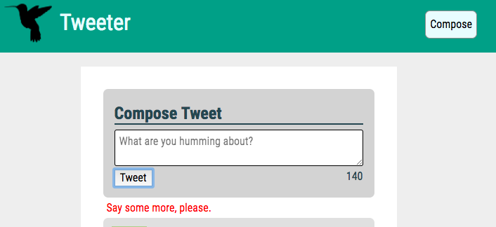

# Tweeter Project

Tweeter is a simple, single-page Twitter clone.

This repository is the starter code for the project: Students will fork and clone this repository, then build upon it to practice their HTML, CSS, JS, jQuery and AJAX front-end skills, and their Node, Express and MongoDB back-end skills.

## ScreenShots

  
 Index view upon original render:  

  
  
 Hover highlighting tweets:  

  
  
 Live character counter while composing tweets:  

  
  
 Error displaced upon failed tweet submission because of insufficient text:  

  
  
 Error displaced upon failed tweet submission because of character count exceeding 140:  

  
  
 Compose button toggles new tweet element using a slide animation:  

  

## Dependencies

  "body-parser":     "^1.15.2"
  "chance":          "^1.0.2"
  "express":         "^4.13.4"
  "md5":             "^2.1.0"
  "mongodb":         "^2.2.26"
